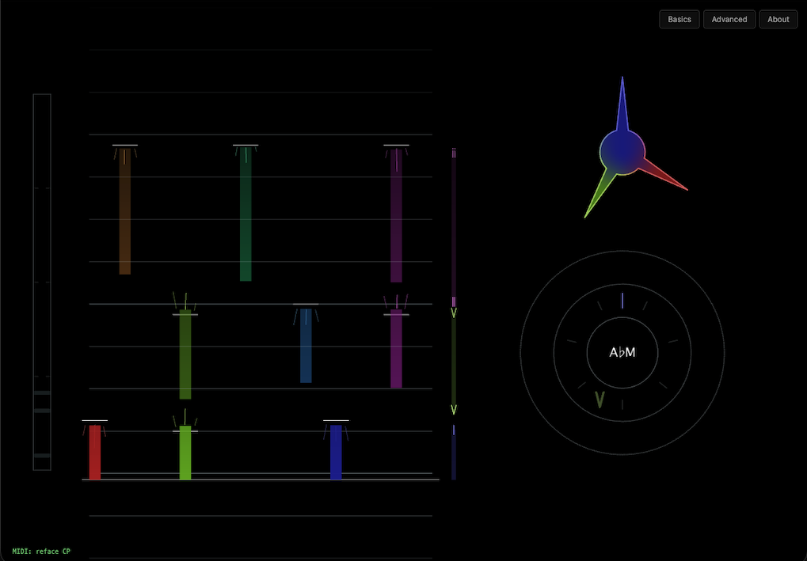
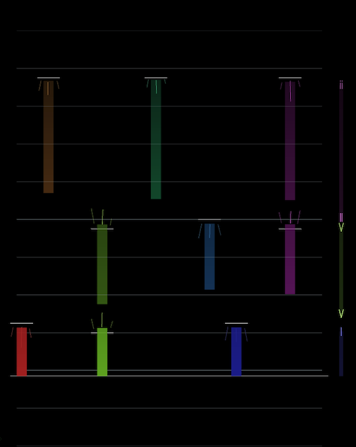

# Synesthetica

Synesthetica is a real-time music visualiser that listens to MIDI or audio and draws it from the perspective of Western music theory. It aims to build musical intuition by representing whatever you play in a coherent visual language. It can be viewed directly as a web page or operated through an LLM.

<a href="https://mcnoose.com/synesthetica" target="_blank" rel="noopener noreferrer">This</a> is the quickest way to see it running but the [LLM-mediated interaction model](#llm-mediated-interaction) is way more interesting.



Tested on Chrome and Claude Desktop.

## Getting started

It'll load in an immediately usable state but it's a lot better if you set up a bit of context for your session.

### Providing input

#### Music source

The default input maps an on-screen musical keyboard to your typing keyboard. It requires no setup but has no velocity, limited range and bad ergonomics. A proper MIDI controller is best. Plug one in and reload the page to see it in the inputs list. Audio is also supported but that's converted to MIDI anyway (by Spotify's <a href="https://basicpitch.spotify.com/" target="_blank" rel="noopener noreferrer">Basic Pitch</a> running in Web Assembly), so you'll get best results by supplying MIDI directly.

#### Key

A key is required to represent functional harmony (e.g. ii → V → I). It still works without a key but you'll see less.

#### Rhythm

It loads up in free time mode. Supply a tempo and time signature to see rhythm analysis. This will give you beat and bar lines, an optional metronome, and a view on how tight your playing is. Timing analysis is relative to a configurable quantise resolution (16ths by default). Swing is not yet supported.

#### Aesthetics

There's a lot you can adjust. Things like pitch → colour mapping, visual emphases, and various tolerances that affect visual stability. These are most useful in the [LLM-mediated interaction model](#llm-mediated-interaction) but work fine in the web view too.

### Web interaction

The important stuff is in the Basics tab. The Advanced tab does what it says too. Every control has a `?` tooltip. Have a look around. <a href="https://mcnoose.com/synesthetica" target="_blank" rel="noopener noreferrer">Here's</a> a hosted version. The npm package can also serve it locally on a bundled web server:

```bash
npx synesthetica start --no-mcp
```

### LLM-mediated interaction

This is where things get interesting. The entire thing is available as an npm package that provides an MCP server on the command line, serves the app on a bundled web server, provides a web socket bridge into the app, exposes a set of tools, and gives a very thorough understanding of the system to your LLM of choice. This lets you interact with the app via an LLM, which can reason about how to achieve your intentions without requiring you to learn the system. The LLM also has access to about an hour of music input history (assuming constant, regular piano playing), which equips it to reason about your playing too. This gives you a voice interface and an intelligent practice assistant in addition to a visual language for music.

#### Add the tool to Claude Desktop

Add this block to your Claude Desktop config file (`~/Library/Application Support/Claude/claude_desktop_config.json` on macOS, `%APPDATA%\Claude\claude_desktop_config.json` on Windows):

```json
{
  "mcpServers": {
    "synesthetica": {
      "command": "npx",
      "args": ["-y", "synesthetica", "start"]
    }
  }
}
```

Restart Claude Desktop after saving. `npx` fetches `synesthetica` from the npm registry the first time it runs and caches it locally, so there's no separate install step. If you'd rather have it installed globally, `npm install -g synesthetica` works too. See [packages/cli/README.md](packages/cli/README.md) for Claude Code and other clients.

Note that the LLM will only spin up context when you start a session or ask about Synesthetica. This keeps the always-on token cost as low as possible, around 50–80 tokens.

#### Start a session

Just open a new chat and ask. This is the fun bit. Try stuff. You could say "I want to visualise some music" or "start a Synesthetica session". Then maybe "I'm using my Arturia keyboard, playing in F# at 90 BPM in 4/4". Maybe "The piece I'm currently practicing looks a bit jittery, can you fix that?". Or even "I just played a piece that I'm struggling with; any tips?". The LLM can see what you've played. It knows how Synesthetica works and can operate it for you. It can also save and load presets, which is currently unavailable in the web UI.

## Overview

### What you'll see

There are three lenses.

#### Dynamics lens


This is the simplest one. It's just a bar on the left of the screen that renders a little strip indicating how hard you played each note. Notes are undifferentiated in pitch and linger a while (you can change how long). This equips your visual memory to see rising and falling trends, stability and spread. No need for fancy graphs because your brain does this well already. The higher the strip, the harder you played.

<br clear="right">


#### Rhythm lens

This is a bit like those piano tutorial videos, where the notes fall toward a keyboard. Except they rise from the keyboard in this case because we're showing what happened instead of prescribing what will - you are the input; do what you want.

There's a "now" line near the bottom that will pulse to the beat if a tempo is supplied. The notes you play will emerge from there and scroll upward. You'll see upcoming beats and bars approach from below the now line.

Notes are arranged horizontally from C to B and are mapped to the colour wheel to give each note a stable colour. You can change this mapping. It is applied throughout the interface. Octaves are ignored.

If you've supplied a tempo, little drift streaks will tell you if you played early or late. Think of them as a nudge; streaks fanning downwards are saying this note would need to be a bit higher / earlier to be on-grid. Ones fanning upwards say the inverse (lower / later). This is analysed relative to the quantise resolution setting. A little horizontal line will show the nearest beat division that each note is assessed against.



#### Harmony lens

This is the most complex one. It has two sections: a chord glyph and a functional harmony clock. Both orient notes radially, like a clock (for the geeks: think of the 12-note semitone / 7-note diatonic structure as analogous to base12 / base7 modular arithmetic).

##### Chord glyph

The chord glyph provides a stable visual language for chord quality, irrespective of root note or voicing. Any minor triad, for example, will always have a squiggly hub and three long spokes with the same spacing, regardless of how it's voiced or where it's rooted.

The hub margin encodes chord quality.

| Chord quality | Hub margin type |
| --- | --- |
| Power / open 5th | Zig-zagged |
| Major | Circular |
| Minor | Squiggly |
| Suspended 2nd | Short-dashed |
| Suspended 4th | Long-dashed |
| Diminished | Concave |
| Augmented | Convex |

The spokes encode intervals. They are classed by length and appear oriented around the clock relative to their intervallic distance. Any two spokes that are a major 3rd apart will be at the same angle to each other. Two spokes that are a minor 3rd apart will have a slightly more acute angle. The root note is always at 0° / 12 o'clock.

| Interval set | Spoke type |
| --- | --- |
| Triads | Long spoke |
| 7th | Mid-length spoke |
| 9th, 11th, 13th | Short spoke |
| Non-diatonic / chromatics | A short line superimposed on the glyph |

Each spoke encodes its specific note using the same colour-mappings applied to the rhythm lens. The hub adopts the colour of the root note. Inversions are subtly indicated by a thicker outline on the bass spoke.

It's kind of a lot to explain verbally but it makes sense when you see it.

|  |  |  |  |
| :---: | :---: | :---: | :---: |
| **C major** | **A minor** | **Cmaj7** | **D♭maj7♯11** |

##### Functional harmony clock

Same idea but instead of notes in a chord we have chords in a key. It shows chord symbols instead of note spokes.

There's an inner ring for the diatonic chords: I is at 0° / 12 o'clock and the rest cycles clockwise through to vii.

The outer ring holds non-diatonic chords. These will appear at the midpoint angle between the two neighbouring diatonic chords. If you play a non-diatonic chord that has a modal-interchange relationship that can resolve back to a diatonic chord, an animated arc will fan out along the clock and visually indicate the implied resolution. This applies over two orders of sub-dominant resolution.

The full chord name appears at the centre of the clock, even if no key is specified and the clock is disabled. If a key is supplied, the chord name is inferred relative to it.

Again, it's a lot to take in verbally. Easier seen in action.

|  |  |
| :---: | :---: |
| **ii–V–I in A♭** | **B major → E♭ major — modal interchange resolving in A♭** |

### How it works


#### Core engine

The pipeline is essentially a buffered event stream, pulled on every frame render. From a type perspective, it goes:

```
(optional Audio to MIDI conversion) → MIDI Input → RawInputFrame → MusicalFrame → AnnotatedMusicalFrame → SceneFrame → Canvas
```

**What this means:**
- Adapters emit protocol-level events (RawInputFrame)
- Stabilizers produce musical abstractions with duration and phase (MusicalFrame)
- Visual vocabularies annotate musical elements with consistent visual properties like colour (AnnotatedMusicalFrame)
- Lenses decide what it *looks like* and which elements to render (SceneFrame)
- A renderer draws it (WebGL Canvas)

#### LLM interop

It's mostly standard MCP (mostly). The interesting part is the multi-modal interface.

There's a [manifest file](packages/contracts/annotations/manifest.ts) where all operations are defined, regardless of interaction model. These, along with some conceptual prose, are compiled into a primer for the LLM. The primer is available on a standalone tool call. It supplies a token alongside the text that is required for all subsequent tool calls. If a token is missing or invalid we error out and supply both the full primer and a new token. This ensures that the LLM has at least received the primer before doing stuff.

The primer is detailed and extensive. It explains system concepts and the musical implications at parameter range extremes. In addition to equipping the LLM to reason about system usage on a person's behalf, it is explicitly given a second role as interpreter and instructed on an appropriate posture.

The whole thing is designed with an LLM as the primary intended user. Retrieving music history reflects this well. The LLM is given an orientation around time, and told how to reason about events relative to the rhythm grid.

The web UI controls are generated from this same manifest, along with human-specific tooltips. I quite like that the manifest enforces these per-tool annotations at the type level.

## Design ethos

This project was partly an experiment in operating alongside LLMs, both as user and builder. I tweaked a few things but Claude wrote all the code.

See [PRINCIPLES.md](PRINCIPLES.md) for a canonical set of guiding principles. These were important.

The workflow is interesting because this project is as much a design exercise as an engineering one. As such, it didn't work to heavily specify. I couldn't let a swarm of agents loose and grind until they're done because I had no idea what done was. Being inherently exploratory, the problem was not verifiable in significant iteration lengths. This demanded a very conversational workflow. I often found myself giving simple prompts like "write the spec", or "go ahead" after fully developing a shared understanding in dialogue. This demanded very careful management of terminology, with explicit promotion through iterative layers of communicative and design certainty. The chord glyph language, for example, was developed initially in unicode, then svg, then html canvas, then webGL canvas. Each stage layered new certainties into emergent specs and glossaries. <a href="https://mcnoose.com/synesthetica/chord-shapes/" target="_blank" rel="noopener noreferrer">Here's</a> an svg-stage test artefact for the curious.

Given the above, I erred towards verbosity and am absolutely not making efficient use of tokens (yet).

## Contributing

```bash
# One-time setup
git clone https://github.com/nicc/synesthetica.git
cd synesthetica
npm install

# Build every workspace, in dependency order
npm run build

# Tests (all workspaces)
npm test -ws

# Lint
npm run lint

# Run the app locally
npm run start              # MCP server on stdio + bundled web-app (what Claude Desktop spawns)
npm run start:standalone   # web-app only, no MCP server — quickest way to iterate on visuals
npm run dev                # Vite HMR against the engine sources — best for tight UI/lens loop
```

## Acknowledgements / built with

- <a href="https://claude.com/claude-code" target="_blank" rel="noopener noreferrer">Claude Code</a> — wrote the code.
- <a href="https://basicpitch.spotify.com/" target="_blank" rel="noopener noreferrer">Basic Pitch</a> (Spotify) — polyphonic pitch detection.
- <a href="https://github.com/tonaljs/tonal" target="_blank" rel="noopener noreferrer">Tonal.js</a> — chord + key theory.
- <a href="https://threejs.org" target="_blank" rel="noopener noreferrer">Three.js</a> — WebGL rendering.
- <a href="https://github.com/modelcontextprotocol/typescript-sdk" target="_blank" rel="noopener noreferrer">MCP TypeScript SDK</a> — the Model Context Protocol plumbing.
- <a href="https://github.com/markedjs/marked" target="_blank" rel="noopener noreferrer">marked</a> — markdown → HTML for the About panel's inline primer view.

## License

Business Source License 1.1 — see [LICENSE](LICENSE). Free for personal, educational, evaluation, and internal non-production use.
